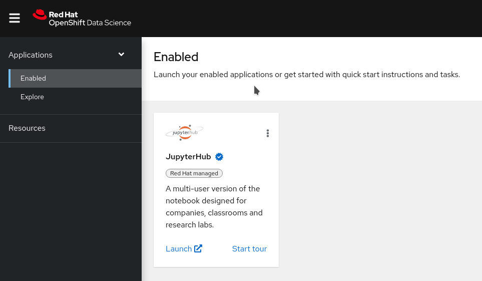
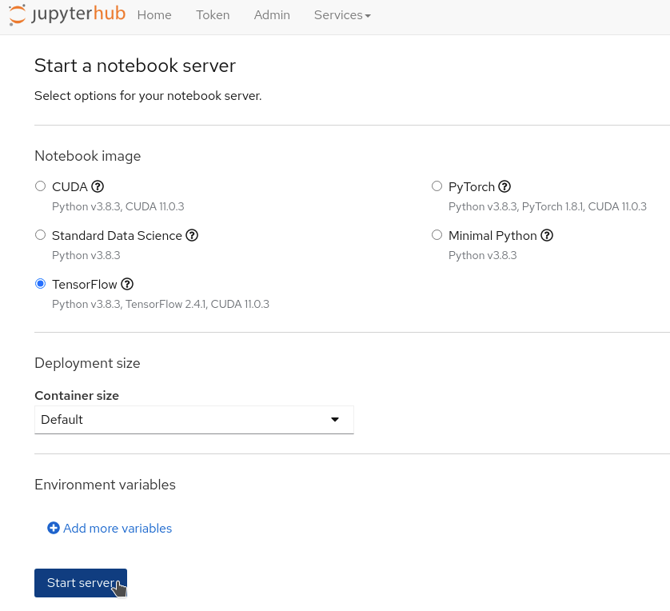

[Back to the introduction](index.html)

# Step 1: Starting a Jupyter environment

You should be now on the **RHODS** dashboard, that looks like this:

{:refdef: style="text-align: center;"}

{: refdef}

**RHODS** brings you on-demand Jupyter Notebooks environments. Don't worry if you've never used notebooks before, this workshop will start with a small tutorial on what they are and how to use them.

* Now that you are connected to the dashboard, click on the "Launch" link on the JupyterHub card:

{:refdef: style="text-align: center;"}

{: refdef}

If it's the first time you're launching Jupyter, you may be sent to a page that will ask you to login and ask for your authorization to use your user account to authenticate to Jupyter. You should of course allow this if you want to do the workshop...

* From the "Start a notebook server" page, there are multiple options you can choose from to launch your environment.
  * For the **Notebook Image** dropdown, select **Tensorflow** (`Python v3.8.3, Tensorflow==2.4.1, CUDA 11.0.3`), as this is the flavor of notebook we want to use. It includes the Tensorflow library, which is used to do image recognition.
  * From the **Container size** dropdown, select `Default`.
  * Leave the **GPUs** selector at `0`.

* At the bottom of the page you can now click on the **Start Server** button:

{:refdef: style="text-align: center;"}

{: refdef}

While your environment is starting,  [let's go to the next section](step2.html)
