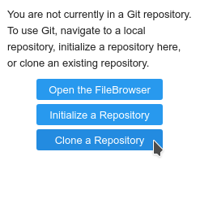
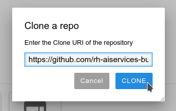
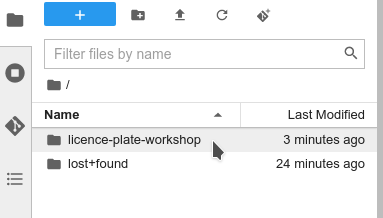

[Back to the previous section](step1.html)

# Step 2: The Jupyter environment

You are now inside you Jupyter environment. As you can see, it's a web-based environment. But everything you'll do here is in fact happening on the **RHODS** cluster. Meaning that without having to install and maintain anything on your own computer, without even disposing of lots of local resources like CPU and RAM, you can still conduct your Data Science work in this powerful and stable managed environment.

In the "file-browser" like window you're in right now, you'll find the files and folders that are saved inside your own personal space inside **RHODS**. It's pretty empty right now though... So the first thing we will do is to bring the content of the workshop inside this environment.

* On the left toolbar, click on the Git icon:

{:refdef: style="text-align: center;"}

{: refdef}

* Then click on "Clone a Repository":

{:refdef: style="text-align: center;"}

{: refdef}

* Enter this URL, `https://github.com/rh-aiservices-bu/licence-plate-workshop.git`, then click on clone:

{:refdef: style="text-align: center;"}

{: refdef}

* It takes a few seconds, after which you can double-clik and navigate to the newly-created folder, `licence-plate-workshop`:

{:refdef: style="text-align: center;"}

{: refdef}
---
{:refdef: style="text-align: center;"}

{: refdef}

[Ready? Let's go to the next section](step3.html)
