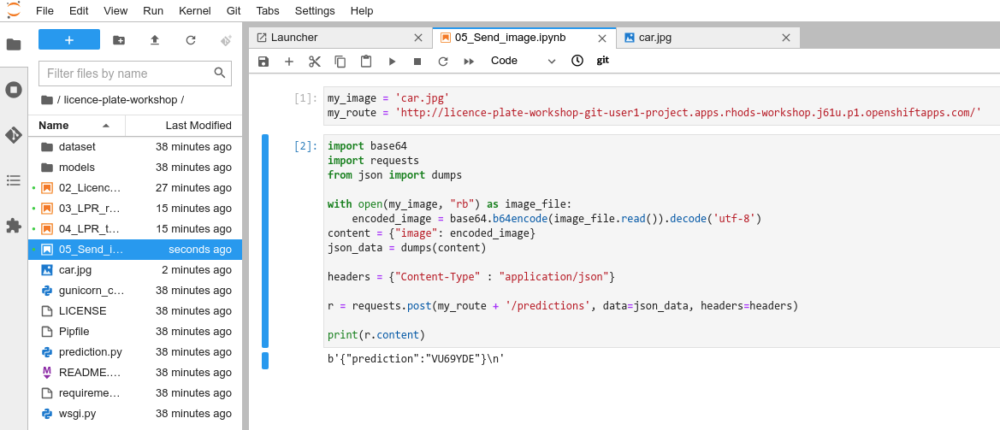

[Back to the previous section](step6.html)

# Testing the application

## App Status

You now have an application listening at the route that was created during the deployment. You can test it but simply clicking on the route link, or copy/paste it in your browser:

{:refdef: style="text-align: center;"}

{: refdef}

## Uploading images

As our application is now a REST API endpoint, there are multiple ways to upload images to it. Here are a few.
*Note*: as our prediction function is waiting for a json payload with a base64 encoded image, we must do this encoding first.

### CURL on Linux or Mac with bash/zsh

From anywhere you have an example image like `car.jpg` (replace with the right name in the command, as well as the Route with `/predictions` at the end):

```bash
(echo -n '{"image": "'; base64 car.jpg; echo '"}') | curl -H "Content-Type: application/json" -d @- http://licence-plate-workshop-git-lpr-workshop.apps.rhods-test.rqdu.p1.openshiftapps.com/predictions
```

### Invoke-WebRequest on Windows with Powershell

From anywhere you have an example image like `car.jpg` (replace with the complete path and name in the command, as well as the Route with `/predictions` at the end):

```powershell
Write-Output ('{"image": "' + ([Convert]::ToBase64String([IO.File]::ReadAllBytes('C:\Users\Guillaume\Downloads\car.jpg'))) + '"}') | iwr -Uri http://licence-plate-workshop-git-lpr-workshop.apps.rhods-test.rqdu.p1.openshiftapps.com/predictions -Method 'POST' -ContentType: 'application/json' | Select-Object -Expand Content
```

### From a notebook

* Open the notebook named `05_Send_image.ipynb`
* Upload an image in your environment
* In the first cell, replace the placeholders with your:
  * Image path and name.
  * Route to the service.
* Run the cells and see the result!

{:refdef: style="text-align: center;"}

{: refdef}

{:refdef: style="text-align: center;"}

{: refdef}

Once you're finished, you can come back here and [head to the next section.](step8.html)
